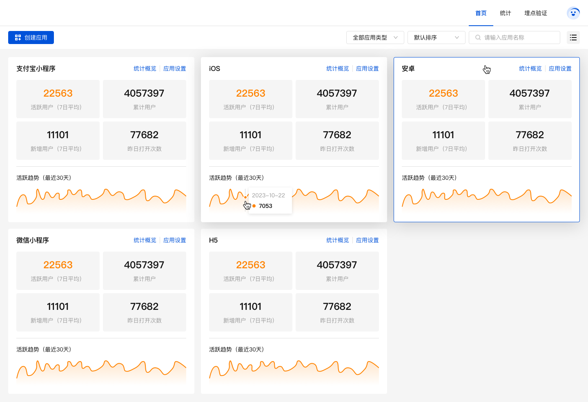
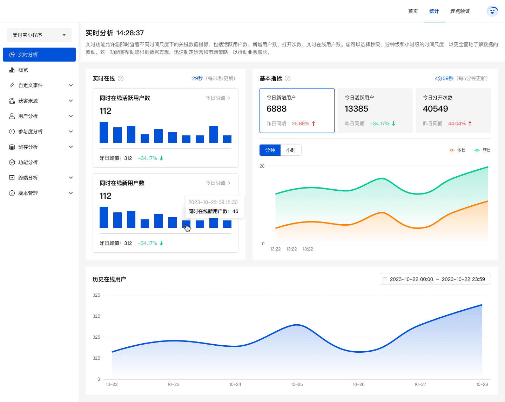
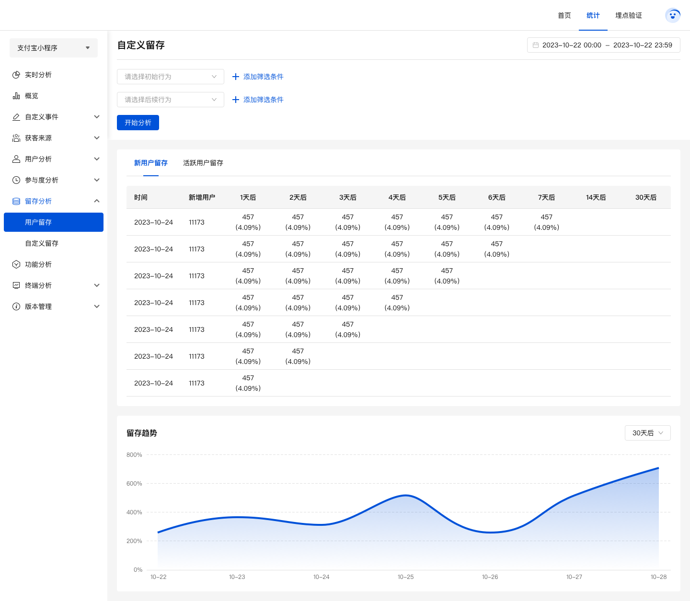
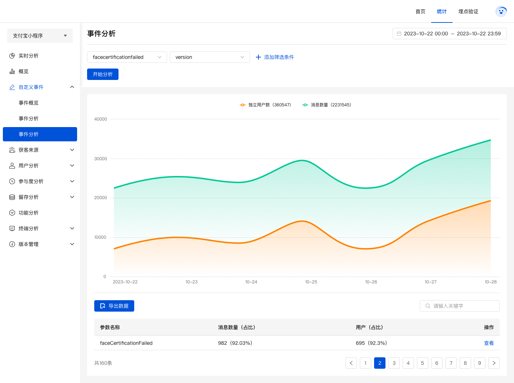

# analytics-admin-front

基于 Vue3 + pinia + ant-design-vue 进行开发

## 联系我们

联系我们，给您最优的服务。欢迎访问 [openhn官网](https://www.openhn.com)


## 前言

全平台（iOS、Android、小程序、web）SDK支持，极简无侵入式接入
一键私有化部署服务，数据完全掌控在您手中
支持日亿级别日志量，洞察大数据背后的秘密

## 功能

-   [x] 实时分析
-   [x] 数据概览
-   [x] 事件概览
-   [x] 事件明细
-   [x] 事件分析
-   [x] 用户统计
-   [x] 启动次数
-   [x] 用户路径
-   [x] 使用时长
-   [x] 用户留存
-   [x] 自定义留存
-   [x] 分辨率
-   [x] ...


## 安装步骤

```
git clone git@github.com:openhnteam/analytics-admin-front.git      // 把模板下载到本地
yarn install         // 安装项目依赖，等待安装完成之后，安装失败可用 cnpm 或 yarn

// 运行
yarn start

// 执行构建命令，生成的dist文件夹放在服务器下即可访问
yarn build
```

## 项目截图

### 首页



### 实时分析



### 留存



## 事件分析

